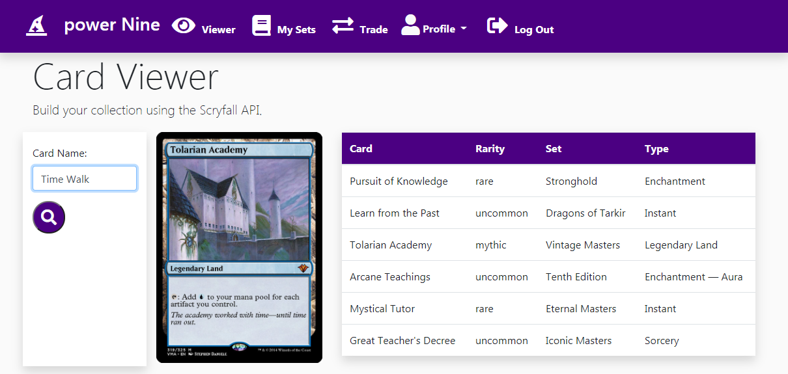

# power Nine

## Description

power Nine is a full-stack application using Node.js, Express, MySQL, Sequelize, Passport, Handlebars, JQuery and Bootstrap. 

Users can signup and create a personalized account. Afterwards, they are able to search, view, and build a virtual representation of
their Magic: The Gathering collection within the viewer. 

Currently in Development: Users can save their displayed cards within a Set in their Collection that can be recalled and viewed.

Future Developments: Users can send and receive requests to trade with other users on the site. 

## Deployed Site:

## Table of Contents

* [Installation](#installation)
* [Usage](#usage)

## Installation

Simply clone the repo, and/or visit the deployed page link to begin.

## Usage
  

## Questions

Contact [Nlamonaco86](mailto:nlamonaco86@gmail.com) with any questions or suggestions!