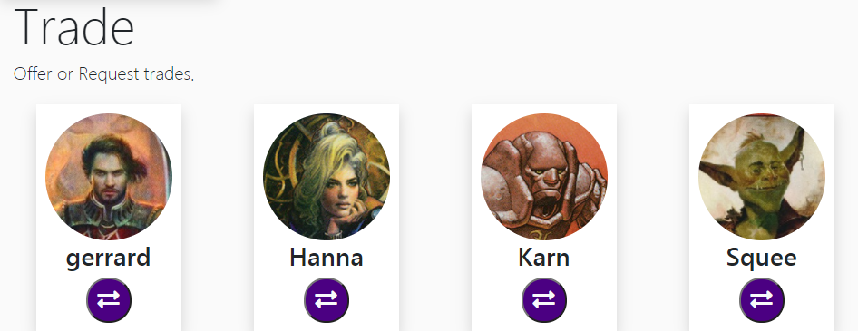

# power Nine

## Description:

power Nine is a full-stack application using Node.js, Express, MySQL, Sequelize, Passport, Handlebars, JQuery and Bootstrap. 

Users can signup and create a personalized account. Afterwards, they are able to search, view, and build a virtual representation of
their Magic: The Gathering collection within the viewer using the Scryfall API.

Users can also recall their own Sets of Cards from within the database for viewing, and the page populates with profiles of all the Users on startup.

The seed data provides four users, and sets of cards for each user. 

## Development:
Currently in Development: 
- Users can save their own Sets of displayed cards within their Collection.
- Users can toggle a set for other users to be able to see or not see its contents.

Future Development:
- Users can send and receive requests to trade with other users on the site. 
- General UI improvements 

## Deployed Site:
Coming Soon!

## Table of Contents

* [Installation](#installation)
* [Usage](#usage)

## Installation

Simply clone the repo, and/or visit the deployed page link to begin.

## Usage
Card viewer in action
  

User Profiles in the Trades section, populated by database

## Questions

Contact [Nlamonaco86](mailto:nlamonaco86@gmail.com) with any questions or suggestions!