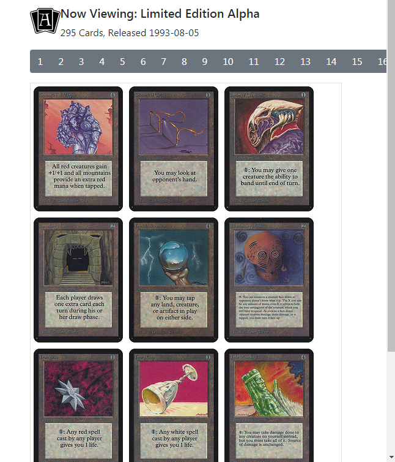
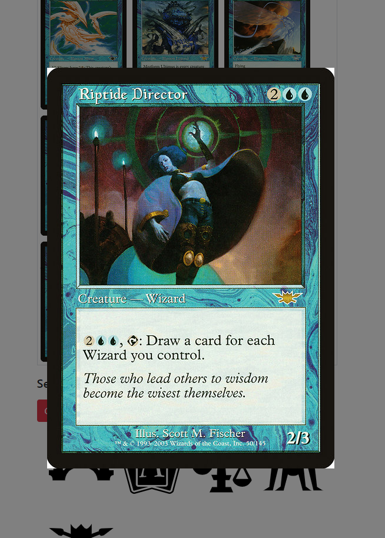

# Power_Nine
A virtual collectible card binder 

by Nicholas La Monaco

This is application intended to virtually display a trading card collection, just like you would in a physical binder

This will be able to search for cards and display them on a 3x3 grid, and turn the page backwards or forwards as you would in a physical binder

The viewer can now search, add, and view individual cards

The viewer can also search by set, and display each set one page at a time

Upcoming functionality will include the baility to save and share custom or pre-made sets

Another goal is functionality to save and share your "binders" with friends through social media & e-mail etc. 

THe initial version will use Scryfall API for Magic: The Gathering, but eventually expand to search other sports and non-sports collectible cards 

